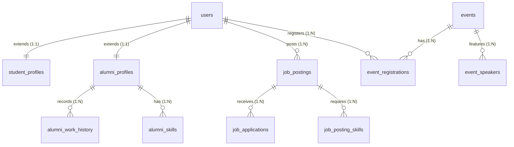

# 🎓 Alumni Sync - Alumni Management System

[](https://www.python.org/)
[](https://flask.palletsprojects.com/)
[](https://www.mysql.com/)
[](LICENSE)

Alumni Sync is a comprehensive, production-ready, full-stack **Alumni Management System** designed to bridge the gap between university students, alumni, and administrators. Built with a robust **Flask (Python)** backend, **Jinja2** templates, and a normalized **MySQL** database, it showcases advanced database design principles and relational architectures.

---

## 👨‍💻 Developer Profile
* **Developer:** Gnanendhiran V
* **Email:** [gnan8905@gmail.com](mailto:gnan8905@gmail.com)
* **GitHub:** [github.com/Gnanendhiran](https://github.com/Gnanendhiran)
* **LinkedIN:** [linkedin.com/in/gnanendhiran](https://linkedin.com)

---

## 📌 Project Features by Role

### 🎓 Students
* **Career Hub:** Browse, search, and apply for jobs/internships posted by alumni.
* **Events Registration:** Discover and register for workshops, reunions, and webinars.
* **Alumni Directory:** Find and filter alumni by degree, company, or skills for guidance/mentorship.
* **Resume/CV Manager:** Keep profiles updated with resumes, LinkedIn links, and skills.

### 💼 Alumni
* **Recruitment Hub:** Post job openings and internships, specify required skills, and manage applications.
* **Event Creators:** Create and manage webinars, meetups, or reunions.
* **Social Feed:** Share updates, links, and documents with students and peers.
* **Career History:** Document full work history and current professional experience.

### 🛡️ Administrators
* **Verification Queue:** Review and moderate incoming student and alumni accounts.
* **System Dashboards:** View real-time user metrics, job post updates, and event stats.

---

## ⚡ DBMS Design & Implementation Features

This project was built to illustrate advanced **Database Management System (DBMS)** concepts:

1. **3NF Normalization (3rd Normal Form):**
   * Structure consists of 43 normalized tables (separating credentials `users` from specific `student_profiles`, `alumni_profiles`, and `alumni_work_history`) to prevent update, insertion, and deletion anomalies.
2. **Referential Integrity Constraints:**
   * Utilizes strict InnoDB Foreign Keys with `ON DELETE CASCADE` and `ON UPDATE CASCADE` to guarantee system-wide consistency.
3. **Database-Level Triggers:**
   * Includes custom MySQL triggers (e.g. `tr_job_application_insert`, `tr_job_application_delete`) to automate data auditing and application counters directly in the database engine.
4. **Analytical SQL Views:**
   * Uses optimized queries packaged into views (e.g., `vw_alumni_by_skill`, `vw_alumni_careers`, `vw_event_speakers`) to accelerate complex joins and dashboards.
5. **Security & Parameterized Queries:**
   * Secured against SQL Injection (SQLi) attacks using parameterized queries via `mysql-connector-python`.

---

## 📊 Core Database Schema

The database revolves around the following relationships:



---

## 🛠️ Technology Stack
* **Backend:** Flask (Python), Jinja2 Templating
* **Database:** MySQL (InnoDB engine)
* **Frontend:** HTML5, Vanilla CSS3 (Custom design, responsive layout), JavaScript
* **Security:** PBKDF2 Password Hashing (`werkzeug.security`)

---

## 🚀 How to Run the Project (Windows)

Make sure you have **MySQL Server** installed and running locally.

### Step 1: Configure Environment Variables
Open the [.env](file:///g:/Alymni-Sync--DBMS-Project-/.env) file in the root folder and input your MySQL configuration:
```env
DB_HOST=localhost
DB_USER=root
DB_PASSWORD=your_mysql_password
DB_NAME=alumni_sync
SECRET_KEY=dev-secret-key
```

### Method 1: The Automated Setup (Recommended)
1. Double-click the [setup_and_run.bat](file:///g:/Alymni-Sync--DBMS-Project-/setup_and_run.bat) file in your project folder.
2. When prompted: `Do you want to initialize/reset the database [Y,N]?`, press `Y` to create the schema and populate mock seed data.
3. Open your browser and navigate to **`http://127.0.0.1:5000`**.

### Method 2: Manual CMD Setup
1. **Create and Activate Virtual Environment:**
   ```cmd
   python -m venv .venv
   call .venv\Scripts\activate
   ```
2. **Install Dependencies:**
   ```cmd
   pip install -r requirements.txt
   ```
3. **Initialize Database and Seed Sample Data:**
   ```cmd
   python init_db.py
   ```
4. **Run the Flask Application:**
   ```cmd
   python app.py
   ```
5. Navigate to **`http://127.0.0.1:5000`** in your browser.

---

## 🔑 Demo Login Credentials

For testing purposes, the database contains seeded accounts:

| Portal | Email | Password | Role Description |
| :--- | :--- | :--- | :--- |
| **Student Portal** | `student@example.com` | `user123` | Can apply for jobs, register for events |
| **Alumni Portal** | `alumni@example.com` | `user123` | Can post jobs, host events, share posts |
